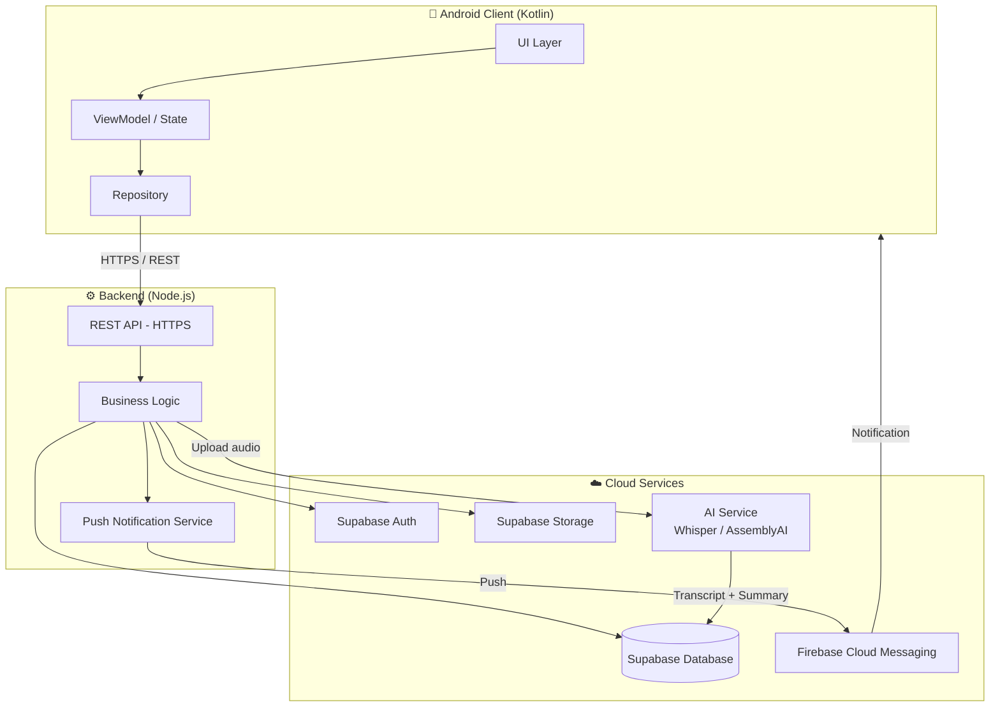
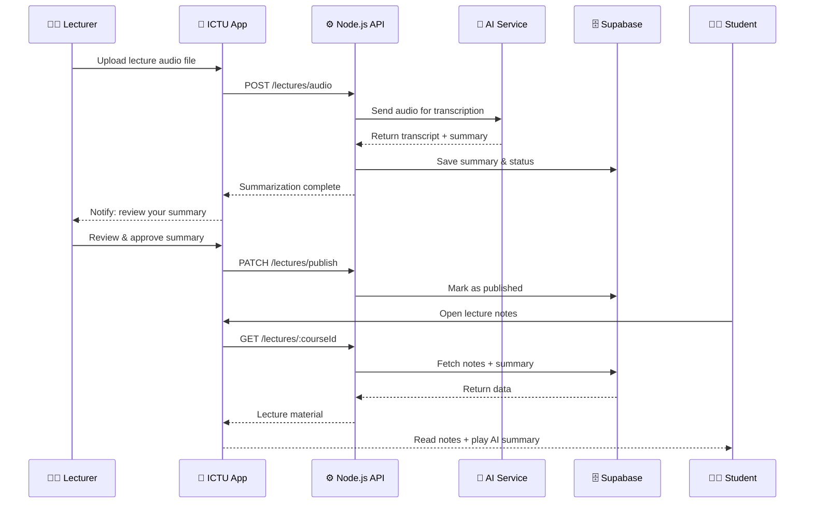
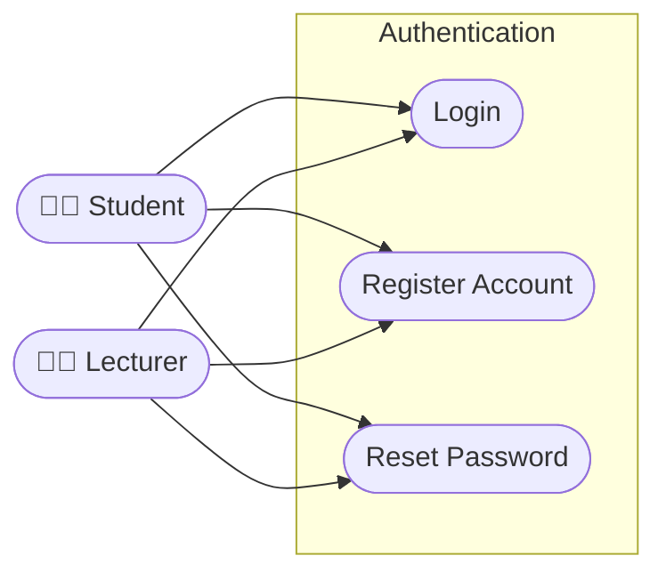
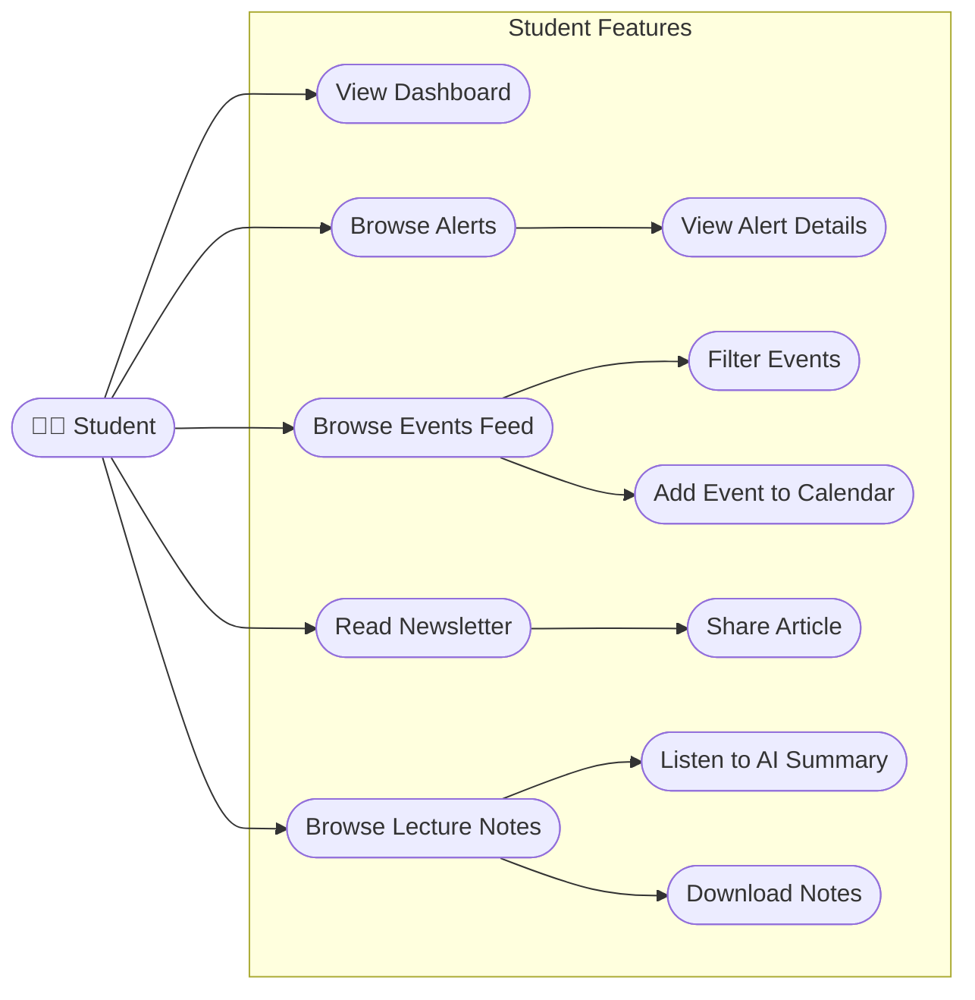
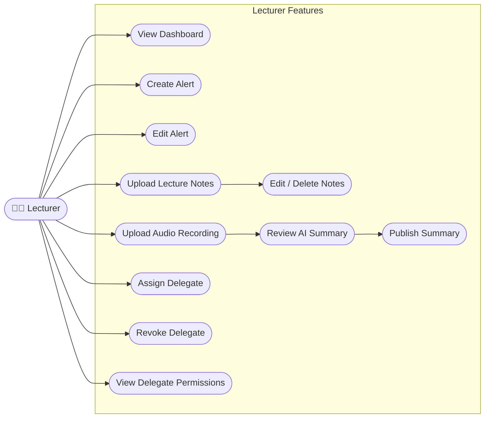
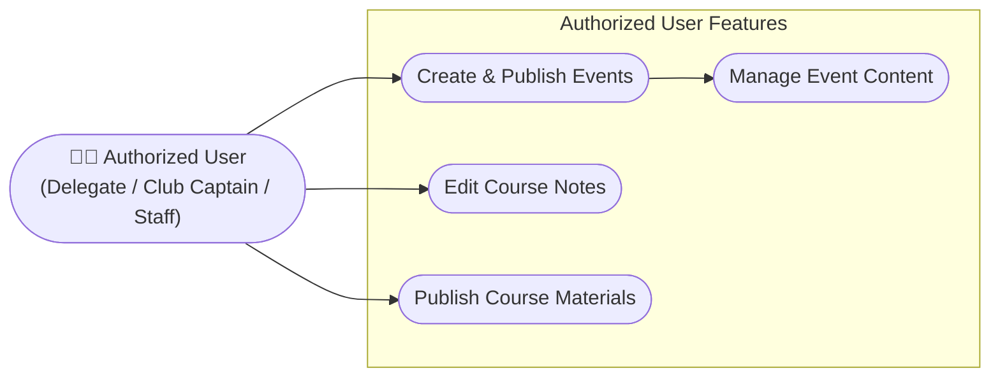

<p align="center">
   

<p align="center">
  
  
  
  
  
</p>

> A centralized mobile platform for students, lecturers, and staff of **The ICT University (ICTU)** — connecting the campus community through alerts, events, newsletters, and AI-powered lecture materials.

---

## 📋 Table of Contents

- [Problem Statement](#-problem-statement)
- [Our Solution](#-our-solution)
- [Features Overview](#-features-overview)
- [Architecture](#-architecture)
- [Use Case Diagrams](#-use-case-diagrams)
- [Tech Stack](#-tech-stack)
- [Non-Functional Requirements](#-non-functional-requirements)
- [Getting Started](#-getting-started)
- [Contributing](#-contributing)

---

## ❗ Problem Statement

Students and lecturers at The ICT University rely heavily on **fragmented, informal channels** — primarily WhatsApp groups and word-of-mouth — for academic communication and information sharing. This leads to several compounding problems:

- 📢 **Missed Alerts:** Assignment deadlines, CA dates, and exam schedules get buried in noisy group chats, causing students to miss critical academic information.
- 🗓️ **Event Invisibility:** Campus events organized by clubs, the marketing department, and faculty go unnoticed by large portions of the student body.
- 📚 **Inaccessible Learning Materials:** Lecture notes are distributed inconsistently, and there is no standardized way for students to access or revisit lecture content after class.
- 🗞️ **No Targeted News:** Students have no structured way to receive news or resources relevant to their faculty or field of study.
- 🔗 **Disconnected Community:** Without a unified platform, the campus community lacks a shared digital space that fosters collaboration and belonging.

---

## 💡 Our Solution

**The ICTU Community** is a native Android mobile application that acts as a **single, unified hub** for all academic and campus life activities at The ICT University. It replaces scattered informal channels with a purpose-built platform that serves students, lecturers, and authorized staff.

Key pillars of the solution:

- **Role-based access** — tailored experiences for Students, Lecturers, and Authorized users (delegates, club captains, ICTO staff).
- **Real-time push notifications** — ensures no alert, event, or news update is ever missed.
- **AI-powered lecture summaries** — lecturers upload audio recordings and an integrated AI service automatically transcribes and summarizes them, making review effortless for students.
- **Faculty-targeted newsletter** — news and resources are filtered to match each student's faculty, reducing noise and improving relevance.
- **Secure, institution-verified authentication** — all accounts are tied to official university email addresses.

---

## ✨ Features Overview

### 🔐 Authentication
| Feature | Description |
|---|---|
| Student & Lecturer Login | Secure sign-in using official university email and password |
| New Account Registration | Self-service registration for newly admitted students and new faculty |
| Password Recovery | Email-based secure password reset flow |

### 🔔 Alerts & Notifications
| Feature | Description |
|---|---|
| Create Academic Alerts | Lecturers publish assignment, CA, and exam notifications |
| Real-time Push Notifications | Students receive instant alerts as soon as they are published |
| Alert Details | Full instructions, deadlines, and course information per alert |

### 📰 Feeds & Events
| Feature | Description |
|---|---|
| Event Feed | Chronological, university-wide feed of announcements and events |
| Rich Event Content | Events support text, images, videos, and external links |
| Category Filtering | Students filter events by type (academic, social, sports, etc.) |
| Add to Calendar | One-tap export of event details to the device calendar |

### 🗞️ Newsletter
| Feature | Description |
|---|---|
| Faculty-targeted News | Articles are surfaced based on the student's faculty |
| Content Variety | Covers tech industry trends, free resources, and faculty news |
| Article Sharing | Students share articles via social media or messaging apps |

### 📚 Lecture Materials
| Feature | Description |
|---|---|
| Upload & Manage Notes | Lecturers upload PDFs and documents for each course |
| AI Audio Summarization | Uploaded lecture recordings are transcribed and summarized by AI |
| Summary Review & Publish | Lecturers review AI summaries before releasing them to students |
| Offline Access | Students download notes for offline reading |

### 👥 Course Delegate Management
| Feature | Description |
|---|---|
| Assign Delegates | Lecturers designate a student as a course delegate |
| Delegate Permissions | Delegates can edit notes and publish materials with lecturer approval |
| Revoke Access | Lecturers can remove delegate privileges at any time |

---

## 🏗️ Architecture

The application follows a **client-server architecture** with a clear separation between the mobile frontend, a RESTful backend API, and managed cloud services.



### Data Flow — AI Lecture Summarization



---

## 📊 Use Case Diagrams

### Authentication Module



### Student Module



### Lecturer Module



### Authorized Users (Delegates / Staff)



---

## 🛠️ Tech Stack

| Layer | Technology | Purpose |
|---|---|---|
| **Mobile** | Kotlin (Android) | Native Android application |
| **Backend** | Node.js | RESTful API & business logic |
| **Database** | Supabase (PostgreSQL) | Persistent data storage |
| **Auth** | Supabase Auth | Email-based user authentication |
| **File Storage** | Supabase Storage | Lecture notes & audio files |
| **AI Service** | OpenAI Whisper / AssemblyAI | Audio transcription & summarization |
| **Push Notifications** | Firebase Cloud Messaging | Real-time alerts delivery |
| **API Communication** | HTTPS / REST | Encrypted client-server communication |

---

## ⚡ Non-Functional Requirements

| Category | Requirement |
|---|---|
| **Performance** | UI transitions and data loading < 2 seconds |
| **Scalability** | Backend handles high concurrency without performance degradation |
| **Security** | All traffic encrypted over HTTPS; passwords hashed & salted |
| **Reliability** | High uptime with resilient backend infrastructure |
| **Usability** | Consistent with Android Material Design guidelines |
| **Maintainability** | Well-structured, documented, and modular codebase |

---

## 🚀 Getting Started

### Prerequisites

- Android Studio Hedgehog or newer
- Node.js v18+
- A Supabase project (with Auth and Storage enabled)
- Firebase project (for push notifications)

### Backend Setup

```bash
# Clone the repository
git clone https://github.com/ictu-community/backend.git
cd backend

# Install dependencies
npm install

# Configure environment variables
cp .env.example .env
# Fill in your Supabase URL, keys, AI service key, and FCM credentials

# Start the server
npm run dev
```

### Mobile Setup

```bash
# Clone the mobile repository
git clone https://github.com/ictu-community/android.git

# Open in Android Studio
# Sync Gradle dependencies
# Update local.properties with your backend API base URL

# Run on emulator or physical device
```

---

## 🤝 Contributing

Contributions are welcome! Please follow these steps:

1. Fork the repository
2. Create a feature branch (`git checkout -b feature/your-feature`)
3. Commit your changes (`git commit -m 'Add: your feature description'`)
4. Push to the branch (`git push origin feature/your-feature`)
5. Open a Pull Request

Please ensure your code follows the project's style guide and all tests pass before submitting.

---

## 📄 License

This project is licensed under the MIT License. See the [LICENSE](LICENSE) file for details.

---

<p align="center">Made with ❤️ for The ICT University Community</p>
